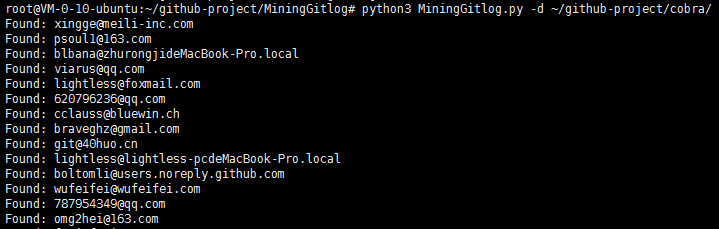

# MiningGitlog
A script to mine email addresses in the Github repository.

用于在Github仓库log记录中采集mail地址的脚本。



## 安装方法及依赖环境
```
git clone https://github.com/omg2hei/MiningGitlog.git
cd MiningGitlog/
pip3 install -r requirements.txt
python3 MiningGitlog.py --help
```

## 使用方法
```
usage: MiningGitlog.py [-h] [-u GIT_URL] [-d REPO_DIR] [-un USERNAME]
                       [-on ORGNAME] [--debug DEBUG] [-t GITHUB_TOKEN]

Mining mail information from git log.

optional arguments:
  -h, --help            show this help message and exit
  -u GIT_URL, --url GIT_URL
                        The url address of the git repository
  -d REPO_DIR, --dir REPO_DIR
                        Local address of the git repository
  -un USERNAME, --username USERNAME
                        Please enter the github username
  -on ORGNAME, --orgname ORGNAME
                        Please enter the github organization name
  --debug DEBUG         Turn on debug mode
  -t GITHUB_TOKEN, --token GITHUB_TOKEN
                        Please enter github token
```
最后扫描结果保存在当前目录下的```result```文件中。

## 常用方法案例
注：需要从Github的仓库中获取邮箱信息时，请通过```-t```参数指定Github_token值

收集指定Github仓库commit记录中包含的邮箱信息：
```
python3  MiningGitlog.py -u https://github.com/vulhub/vulhub.git -t Github_token
```

收集指定Github用户全部仓库commit记录中包含的邮箱信息：
```
python3  MiningGitlog.py -username omg2hei -t Github_token
```

收集指定Github组织全部仓库commit记录中包含的邮箱信息：
```
python3  MiningGitlog.py -orgname twitter -t Github_token
```

收集本地git仓库commit记录中包含的邮箱信息：
```
python3  MiningGitlog.py -d ~/github-project/vulhub
```
